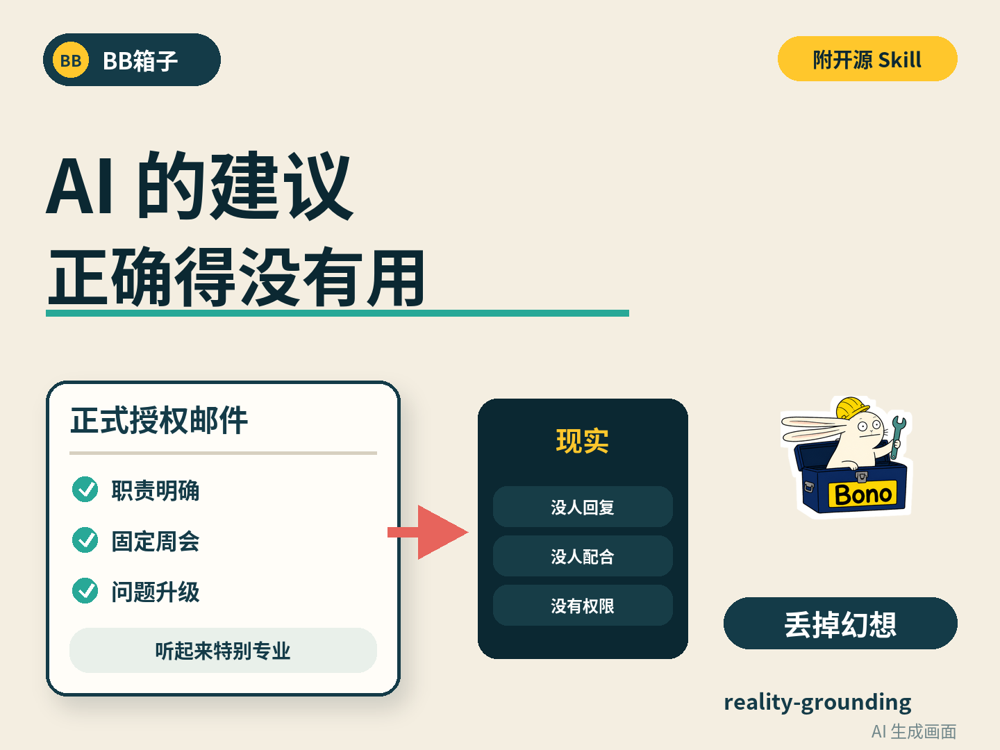

# 丢掉幻想：Reality Grounding Skill



很多 AI 建议每句话都正确，放进真实公司却一步也走不动。它会默认经理愿意授权、其他部门愿意配合、制度写了就会执行，也容易把自己猜出来的条件当成已经存在。

`reality-grounding` 要求 Agent 在给建议、做计划或设计系统前，先找到真正会改变行动的未知信息：实际权限、谁能批准或拖住、正式制度与日常做法的差异、已有证据、失败和接管条件。它会优先查看用户已经提供或授权的材料，只在答案会改变下一步时提问。

## 直接交给 Agent

把下面这段话发给支持本地文件和 Agent Skills 的 Agent：

```text
请打开下面的项目，完整阅读 README.md 和 QUICKSTART.md：
https://github.com/Bono12138/bonobox/tree/main/tools/reality-grounding

请先检查你当前是否支持 Agent Skills，再把 reality-grounding 安装到当前 Agent 实际使用的 Skill 目录。不要覆盖同名 Skill；如果已经存在，请先比较差异并告诉我。

安装后运行：
python verify.py --skill-path <实际安装后的 reality-grounding 目录>

验证通过后，请明确告诉我：安装到了哪里；当前 Agent 是否能发现这个 Skill；验证器是否 PASS。然后用 $reality-grounding 重新分析我刚才的问题。先检查实际权限、参与的人、平时真正采用的做法，以及哪些未知信息会改变行动。不要默认别人一定会配合。

不要让我在聊天中发送密码、Token、Cookie、公司内部资料或客户数据，也不要绕过现有安全设置。
```

如果 Agent 不支持 Skills，它仍然可以读取 `reality-grounding/SKILL.md` 作为当前任务的参考说明，但这不等于已经安装，也不能保证以后自动触发。

## 自己安装

需要 Python 3.9+。以下命令都在本目录运行。

安装到通用 Agent Skills：

```bash
python install.py --target agents
```

安装到 Codex：

```bash
python install.py --target codex
```

安装到 Claude Code：

```bash
python install.py --target claude
```

安装到指定 Skill 根目录：

```bash
python install.py --path /path/to/skills
```

安装器不会覆盖已有的同名 Skill。目标已经存在但内容不同时，它会停止，让你先检查差异。

安装完成后运行：

```bash
python verify.py --skill-path /实际路径/reality-grounding
```

看到以下输出，才能确认文件、引用和结构验证器已经安装完整：

```text
PASS skill_files
PASS local_references
PASS standalone_boundary
PASS record_validator
PASS reality-grounding verification complete
```

## 它会怎样改变回答

普通建议可能直接说：

> 请经理发一封正式授权邮件，明确各部门职责，并建立固定周会。

安装 Skill 后，Agent 应先区分几种情况：用户缺少的是正式决策权、一次读取资料的权限，还是其他人的实际配合；过去类似事情怎样推进；谁能批准，谁可以一直拖着不处理；有没有不影响现有工作的可逆测试。没有查清的条件会保留为未知，不会被包装成已经具备。

## 能力边界

- 它不会读心，也不会自动知道所有不成文规则。
- 它不会扩大 Agent 的文件、系统或组织权限。
- `verify.py` 能证明安装文件完整、引用有效、记录验证器能拦住结构错误；它不能证明每种模型、每个宿主都会稳定触发 Skill。
- 真正使用时仍要检查 Agent 是否发现并调用了 `reality-grounding`，再用一个实际问题观察回答有没有先调查现实条件。
- 不要为了完成调查把公司资料、客户数据、账号或凭据上传到公开 Issue。

## 测试和反馈

本项目包含六类行为案例和结构验证器。测试方法及当前结果见 [测试报告](docs/TEST-REPORT.md)。

如果安装成功、触发失败、回答仍然跳过现有证据，或某个 Agent 不支持这种 Skill 结构，请提交 [Reality Grounding 反馈](https://github.com/Bono12138/bonobox/issues/new?template=reality_grounding_feedback.yml)。提交前删除公司名称、人物姓名、内部网址、文件内容、真实任务信息、账号、凭据和本机绝对路径。

许可证：[MIT](LICENSE)。
