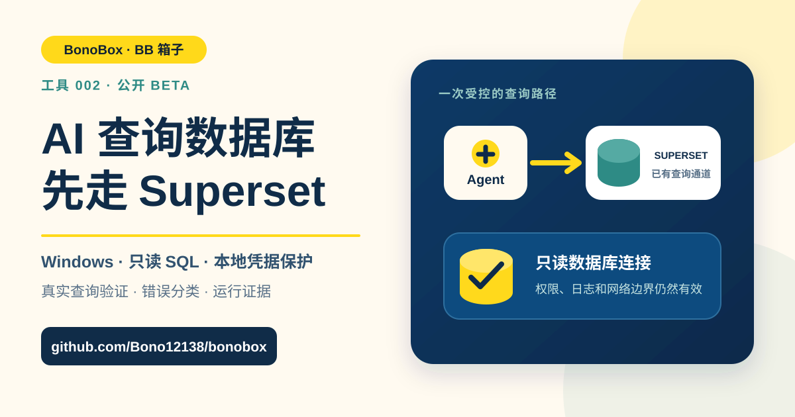

<p align="center">
  
</p>

<h1 align="center">Superset 只读查询 Skill</h1>

<p align="center"><strong>让 Agent 继续走你已经在使用的 Superset 查询通道。</strong></p>

<p align="center">
  <a href="README.en.md">English</a> ·
  <a href="QUICKSTART.md">五分钟开始</a> ·
  <a href="COMPATIBILITY.md">兼容性清单</a> ·
  <a href="https://github.com/Bono12138/bonobox/issues/new?template=data_platform_compatibility.yml">提交兼容性报告</a> ·
  <a href="https://github.com/Bono12138/bonobox/issues/new?template=superset_query_bug.yml">报告问题</a> ·
  <a href="https://github.com/Bono12138/bonobox/issues/new?template=superset_compatibility.yml">申请适配</a>
</p>

## 它解决什么问题

很多“AI 查询数据库”方案要求重新开放数据库地址、驱动、账号和网络通道。这个工具采用另一条路线：Agent 使用员工本人已有的 Superset SQL Lab 通道执行查询。

它负责：

- 把自然语言问题转换成有边界的只读 SQL；
- 通过 Superset 登录和执行查询；
- 主动拦截写入、管理命令和多条 SQL；
- 区分认证、权限、语法、对象、资源、超时、网络和服务端错误；
- 保存 SQL、CSV、耗时、哈希和查询编号，方便复核。

它不负责：

- 绕过 Superset、VPN、SSO、MFA、权限或行级安全；
- 自动确认业务口径；
- 执行写入、建表、删表或管理命令；
- 大批量数据下载；
- 连接 Power BI；
- 兼容所有 Superset 部署。

## 首版兼容范围

当前公开 Beta 支持：

- Windows 10 或 11；
- Python 3.10 或更高版本；
- Superset 用户名密码表单登录；
- 旧版同步 SQL Lab 接口 `/superset/sql_json/`；
- 用户本人已经拥有 SQL Lab 查询权限；
- 用户知道数据库连接 ID 和默认 schema。

如果你的 Superset 使用 SSO、OAuth、MFA、自定义登录页或只开放新版 API，请不要尝试绕过认证。提交[兼容性申请](https://github.com/Bono12138/bonobox/issues/new?template=superset_compatibility.yml)，我们会根据脱敏后的环境信息安排适配。

Power BI、Metabase、DBX、Databricks 和其他企业数据平台目前还没有连接器。它们不是本工具已经支持的功能，但用户可以提交[数据平台兼容性报告](https://github.com/Bono12138/bonobox/issues/new?template=data_platform_compatibility.yml)。成功、失败和当前不支持都算有效样本；项目会根据重复需求、可获得的安全测试环境和维护成本决定开发顺序。DBX 具体指什么产品和接口也请在报告中说明，不默认把它当作 Databricks。当前证据见[兼容性清单](COMPATIBILITY.md)。

## 直接把这段话发给你的 Agent

用户不需要自己判断应该运行哪些命令。把下面整段提示词复制给自己的 Agent 即可：

```text
请打开并检查这个公开项目：
https://github.com/Bono12138/bonobox/tree/main/tools/superset-query

先完整阅读 README.md、QUICKSTART.md、COMPATIBILITY.md、query-superset/SKILL.md 和安全说明。第一步只做环境体检，确认我的操作系统、Python、Agent 类型、数据平台、平台版本、登录方式、查询接口和本人已有权限。

如果我的环境属于当前支持范围：
1. 从 GitHub Release 下载 ZIP 和同名 .sha256，核对 SHA-256 后再解压；
2. 按文档安装到当前 Agent 的 Skill 目录；如果没有预设安装目标，使用明确的自定义目录，不要猜路径；
3. 需要密码时，只让我本人在交互式终端中隐藏输入；不要让我把密码、Cookie、Token 或会话发到聊天里；
4. 不要关闭 TLS，不要绕过 SSO、MFA、VPN、公司证书或权限控制，不要扩大数据库权限；
5. 依次运行单元测试、status 和 doctor；doctor 必须真实执行 SELECT 1；
6. 只有测试通过、身份一致且 doctor 成功，才能告诉我安装成功。

如果当前环境不支持，或者安装、认证、doctor、查询任一步失败：
1. 停止盲目重试，不要修改企业安全设置来强行兼容；
2. 说明失败发生在哪一步，以及这是操作错误、权限问题、网络问题还是当前版本尚未适配；
3. 如果已能运行脚本，使用 compatibility-report 生成脱敏报告；否则按照 GitHub 的 Data platform compatibility report 模板整理草稿；
4. 删除公司名称、内部网址、用户名、凭据、Cookie、Token、SQL、查询结果、数据库和表名、查询编号、本机隐私路径、客户数据与内部截图；
5. 成功、部分成功、失败或当前不支持都要准备兼容性报告；开发建议另写清楚用户场景和期望动作；
6. 在提交公开 GitHub Issue 前，把完整内容给我检查和确认。如果你不能操作 GitHub，就给我一份可以直接复制的 Issue 内容。

最后告诉我：环境判断、安装位置、测试结果、doctor 是否成功、当前限制，以及准备提交哪一种兼容性报告。不要输出任何密码、会话或公司敏感信息。
```

## 五分钟开始

从 [Superset Query v1.0.0-beta.2 Release](https://github.com/Bono12138/bonobox/releases/tag/superset-query-v1.0.0-beta.2) 下载 ZIP 和 `.sha256` 文件，核对哈希并解压后，在 Windows PowerShell 中运行：

```powershell
.\install.ps1 -Target Codex
.\verify.ps1
```

如果使用 Cursor：

```powershell
.\install.ps1 -Target Cursor
.\verify.ps1
```

随后进入已经安装的 `query-superset` Skill 目录，在交互式终端运行：

```powershell
python scripts\superset_query.py configure
python scripts\superset_query.py auth
python scripts\superset_query.py doctor
```

`auth` 会隐藏密码输入，并使用 Windows DPAPI 保存。密码、Cookie 和会话不会写入仓库。`doctor` 必须真实执行一次 `SELECT 1`；只有它通过，才说明当前机器和 Superset 部署已经连通。

完整步骤、数据库连接 ID 的说明和可复制给 Agent 的安装提示词见[五分钟开始](QUICKSTART.md)。

## 日常使用

安装完成后，可以直接对 Agent 说：

```text
使用 $query-superset，查询本月各产品的订单数。
先确认相关表和字段，只查汇总结果，不拉客户明细。
说明日期字段、产品范围和去重口径，并把最终 SQL 一起给我。
```

长 SQL 建议保存为文件：

```powershell
python scripts\superset_query.py run --sql-file C:\path\query.sql
```

工具默认把完整结果、实际 SQL 和 manifest 保存到当前 Windows 用户的本地应用数据目录。聊天中只显示小型预览。

默认最多接收和保存 10,000 行，配置时可用 `--max-result-rows` 调低。请求会把上限传给 Superset；如果服务端忽略上限并返回更多行，本地会拒绝保存。旧版同步接口仍可能先把响应传到本机，再执行本地行数检查，因此它只适合小结果，不适合批量导出。

## 安全边界

本地检查会拦截常见写入和管理形式，但它不是完整 SQL 解析器，也不是数据库防火墙。最终只读必须由 Superset 和底层数据库权限保证。管理员仍需保证：

- Superset 和底层数据库账号保持最小只读权限；
- SQL Lab 权限符合组织要求；
- 行级安全是否覆盖当前 SQL Lab 路径已经确认；
- 组织允许当前 Agent 和模型处理相关数据；
- 查询结果和本地 CSV 按数据分类要求保存和清理。

不要把 Superset 地址、用户名、密码、Cookie、token、真实 SQL、查询结果、客户数据或内部截图提交到公开 Issue。

## 遇到问题怎样反馈

### 成功、失败或其他数据平台

运行 `compatibility-report` 生成固定字段的脱敏草稿，再使用[数据平台兼容性报告](https://github.com/Bono12138/bonobox/issues/new?template=data_platform_compatibility.yml)。这个入口接受成功、部分成功、失败、当前不支持以及新连接器需求。用户本人必须在公开提交前复核 Agent 生成的内容。

```powershell
python scripts\superset_query.py compatibility-report --result success --platform superset-legacy --platform-version 4.1 --login-type password-form --transport legacy-sync --agent codex --database-type trino --doctor-result passed --failure-stage none --error-category none
```

### 安装或查询故障

使用[Bug 模板](https://github.com/Bono12138/bonobox/issues/new?template=superset_query_bug.yml)。请提供：

- 工具版本；
- Windows、Python 和 Superset 版本；
- 登录方式；
- 执行的命令名；
- 工具返回的错误类别；
- 已脱敏的错误片段；
- 能否在浏览器中正常使用 SQL Lab。

不要粘贴原始 manifest。查询编号也可能属于内部信息；除非维护者明确要求并确认可以公开，否则请删除。

### 当前不兼容

使用[兼容性模板](https://github.com/Bono12138/bonobox/issues/new?template=superset_compatibility.yml)。说明登录方式、是否启用新版 API、期望支持的动作，以及是否能提供不含真实数据的测试环境或复现步骤。

### 安全问题

不要创建公开 Issue。按仓库的[安全策略](https://github.com/Bono12138/bonobox/blob/main/SECURITY.md)使用 GitHub Private Vulnerability Reporting。

## 当前验证

- 常见写入和管理形式拦截、结果行数上限、CSV 公式防护、错误分类、重试上限、会话身份绑定、查询状态和证据保存均有自动测试；
- Windows DPAPI 和旧版同步 SQL Lab 路线已在一个真实企业 Superset 部署中完成使用验证；
- 公开包经过路径、凭据、内部地址、公司信息、SVG 和发布文件白名单检查；
- 其他 Superset 版本和认证方式仍需通过 `doctor` 逐个确认。
- `compatibility-report` 只输出固定的公开环境字段，不读取或输出 Superset 地址、用户名、数据库连接 ID、schema、SQL或结果。

测试通过不等于你的部署一定兼容。真实成功标准是：`status` 配置完整、`doctor` 的 `SELECT 1` 成功，并且底层权限仍然只读。

## 许可证

自有代码采用 [MIT License](LICENSE)。第三方依赖见 [THIRD_PARTY_NOTICES.md](THIRD_PARTY_NOTICES.md)。
